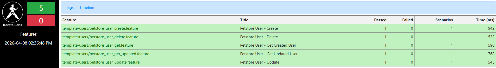
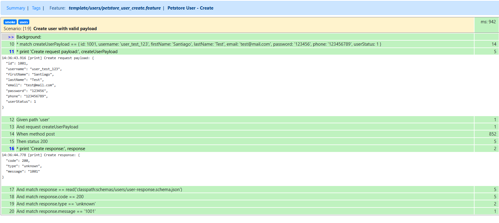

# Automatización Karate
Proyecto de pruebas API con Karate para Petstore Swagger.

## Qué se implementó
- POST /user para crear usuarios.
- GET /user/{username} para consultar el usuario creado.
- PUT /user/{username} para actualizar el nombre y el correo del usuario.
- GET /user/{username} para consultar el usuario actualizado.
- DELETE /user/{username} para eliminar usuarios.

## Estructura actual
- src/test/java/template/users/ -> pruebas de usuarios separadas por escenario.
- src/test/java/template/users/UsersRunner.java -> runner principal de users.
- src/test/java/template/RunAllTests.java -> runner general del proyecto.
- src/test/resources/data/users/ -> payloads de usuario.
- src/test/resources/schemas/users/ -> esquemas de respuestas de usuario.
- .github/requirements/ -> requerimientos del taller.
- .github/specs/ -> specs aprobadas para la automatización.

## Cómo ejecutarlo
```bash
mvn test
```

Ejecución por runner:

```bash
mvn test -Dtest=RunAllTests
mvn test -Dtest=UsersRunner
```

## Evidencia
Reporte de ejecución de Karate en `target/karate-reports/`.





## Nota
El proyecto usa `karate-config.js` para definir `petstoreBaseUrl`.
La convención actual es un feature por escenario principal, con su runner correspondiente en users.